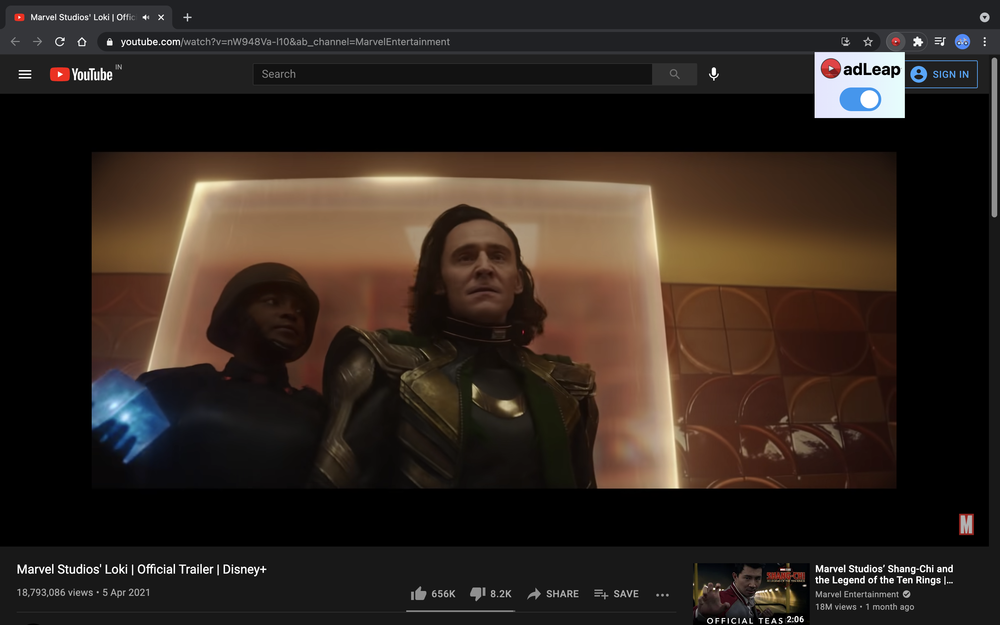

# adLeap
This extension helps you by skipping youtube ads automatically and get rid of ad banners.
## Installation :
1. Clone the repository or download and extract the zip file.
2. Goto the following address in your chrome browser :
   ##### chrome://extensions
3. Turn on developers mode by clicking on the option in the top right corner.
4. Click on Load Unpacked and select the adLeap Folder
5. Go to a Youtube page and the extension will enable in the top right section of your browser.

## SCREENSHOT :

## Contact Developer :
<rajashwin1163@gmail.com>\
[linkedin.com/in/rexashwin](https://linkedin.com/in/rexashwin)